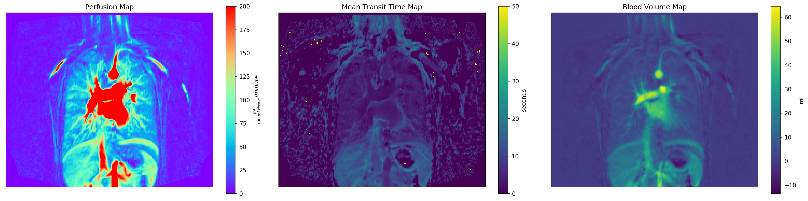

Clinical parameters for chronic obstructive pulmonary disease (COPD) are of paramount importance in determining clinical parameters for the identification of biomarkers for treatment and therapy monitoring. This is the companion repository for the [JMRI] publication: ["Deep Semantic Lung Segmentation for Tracking Potential Pulmonary Perfusion Biomarkers in Chronic Obstructive Pulmonary Disease (COPD): The Multi-Ethnic Study of Atherosclerosis COPD Study"][paper]. The code implements a non-parametric deconvolution for 4D DCE MRI scans according to Sourbron et al. ([PMI-0.4]) and Zöllner et al. (UMMPerfusion) in Python and Matlab.

Please see the ipython notebook (example.ipynb) for instructions on how to use the code.

Referencing
===========
If you use this code in your research, please reference the the following publication:  
> Hinrich B. Winther, Marcel Gutberlet, Christian Hundt, Till F. Kaireit, Tawfik Moher Alsady, Bertil Schmidt, Frank Wacker, Yanping Sun, Sabine Dettmer, Sabine K. Maschke, Jan B. Hinrichs, Sachin Jambawalikar, Martin R. Prince, R. Graham Barr, and Jens Vogel‐Claussen. “Deep Semantic Lung Segmentation for Tracking Potential Pulmonary Perfusion Biomarkers in Chronic Obstructive Pulmonary Disease (COPD): The Multi‐ethnic Study of Atherosclerosis COPD Study.” Journal of Magnetic Resonance Imaging, July 2019. https://doi.org/10.1002/jmri.26853.

Funding Information
===================
  - Deutsche Forschungsgemeinschaft. Grant Number: WI 4739/1‐1
  - National Center for Advancing Translational Sciences. Grant Numbers: UL1‐TR‐000040, UL1‐TR‐001079, UL1‐TR‐001420
  - National Heart, Lung, and Blood Institute. Grant Numbers: HHSN268201500003I, N01‐HC‐95159, N01‐HC‐95160, N01‐HC‐95161, N01‐HC‐95162, N01‐HC‐95163, N01‐HC‐95164, N01‐HC‐95165, N01‐HC‐95166, N01‐HC‐95167, N01‐HC‐95168, N01‐HC‐95169, R01‐HL077612, R01‐HL093081

[JMRI]: https://onlinelibrary.wiley.com/journal/15222586
[paper]: https://doi.org/10.1002/jmri.26853
[PMI-0.4]: https://github.com/plaresmedima/PMI-0.4
[UMMPerfusion]: http://ikrsrv1.medma.uni-heidelberg.de/redmine/projects/ummperfusion